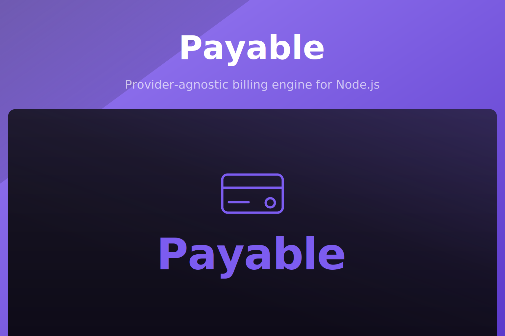

<p align="center">
  
</p>

<p align="center">
  <a href="https://www.npmjs.com/package/@akira-io/payable"></a>
  <a href="https://www.npmjs.com/package/@akira-io/payable"></a>
  <a href="https://www.npmjs.com/package/@akira-io/payable"></a>
  <a href="https://github.com/akira-io/payable/actions/workflows/test.yml"></a>
  
  
</p>

Payable is a Laravel Cashier-inspired billing engine for Node.js: framework-agnostic, provider-agnostic,
storage-agnostic, and queue-agnostic. The core knows only contracts, DTOs, actions, value objects, and
state machines - never a provider SDK, HTTP framework, or database client. Money is always handled in
minor units through a `Money` value object backed by Dinero.js, so monetary logic never touches floats.

## Features

- **Providers**: Stripe and Paddle, behind one `PaymentProvider` contract.
- **Billing**: checkout, subscriptions (trials, coupons, multiple items, swap/cancel/resume), one-off
  charges, refunds, invoices, and the customer billing portal.
- **Webhooks**: signature verification, event normalization, deduplication, async processing, local
  state reconciliation, and replay.
- **Reliability**: idempotency by default, an immutable audit log, and a transactional outbox.
- **Storage / queue**: Knex storage driver; synchronous or BullMQ queue driver.
- **HTTP adapters**: Express, Fastify, and NestJS, each on its own subpath export.
- **MCP adapter**: expose billing to AI clients (Claude Desktop/Code) over stdio or HTTP.

Every provider, storage, queue, and framework dependency is an **optional peer** - the core runtime
bundle imports none of them. You install only what you use.

## Install

```sh
npm install @akira-io/payable   # or: pnpm add / bun add
```

Then add the optional peers for the features you use:

| Feature         | Install                                              |
| --------------- | ---------------------------------------------------- |
| Stripe provider | `npm i stripe`                                       |
| Paddle provider | `npm i @paddle/paddle-node-sdk`                      |
| Knex storage    | `npm i knex` + a driver (`pg`, `better-sqlite3`, …)  |
| BullMQ queue    | `npm i bullmq`                                        |
| Express adapter | `npm i express`                                      |
| Fastify adapter | `npm i fastify`                                      |
| NestJS adapter  | `npm i @nestjs/common reflect-metadata`              |
| MCP adapter     | `npm i @modelcontextprotocol/sdk`                    |

## Quick start

```ts
import { createPayable, Money, StripeProvider } from '@akira-io/payable';

const payable = createPayable({
  providers: {
    stripe: new StripeProvider({
      secretKey: process.env.STRIPE_SECRET_KEY ?? '',
      webhookSecret: process.env.STRIPE_WEBHOOK_SECRET ?? '',
    }),
  },
  // storage, queue, events, clock are optional and injected the same way.
});

// Money is always in minor units - never floats, never toFixed.
Money.of(9900, 'USD').format(); // "$99.00"

const billable = { billableType: 'User', billableId: user.id, email: user.email };

// Subscription checkout (returns a provider checkout session to redirect to).
await payable
  .customer(billable)
  .newSubscription('default')
  .price('price_pro_monthly')
  .trialDays(14)
  .checkout({ successUrl: 'https://app.com/success', cancelUrl: 'https://app.com/cancel' });
```

`payable.customer(billable)` also exposes `charge(...)`, `billingPortal(returnUrl)`, a payment-mode
`checkout()` builder, and `subscription(name)` for `swap` / `cancel` / `cancelNow` / `resume`.
`payable.refund(...)`, `payable.receiveWebhook(...)`, `payable.replayWebhook(...)`, and
`payable.outbox()` are available on the facade.

## Persistence

Subscriptions, payments, webhooks, idempotency keys, the audit log, and the outbox are persisted
through a `StorageDriver`. The bundled Knex driver provisions its schema with `migrate(knex)`:

```ts
import knex from 'knex';
import { KnexStorageDriver, migrate } from '@akira-io/payable';

const db = knex({ client: 'pg', connection: process.env.DATABASE_URL });
await migrate(db); // creates tables and applies additive column migrations; safe to run repeatedly

const payable = createPayable({
  providers: { stripe: /* … */ },
  storage: new KnexStorageDriver(db),
});
```

Webhooks, idempotency, the audit log, and the outbox require a storage driver. Charges, refunds, and
subscription management require one too.

## Webhooks and HTTP adapters

Each adapter ships on its own subpath. All three mount the core routes: `POST /webhooks` and
`POST /webhooks/:provider`, `POST /checkout`, and `POST /subscriptions/:name/{cancel,cancel-now,resume,swap}`.
Adapter coverage is not yet at parity: Express also implements `POST /refunds`, while
`customers` / `invoices` / `payments` (and `refunds` on Fastify/NestJS) are reserved and respond `501`.
See [docs/adapters](docs/adapters/22-express.md) for the exact route table per adapter.

The MCP adapter (`@akira-io/payable/mcp`) exposes the facade to AI clients as tools over stdio or
streamable HTTP, with money movement off by default. See [docs/adapters/25-mcp.md](docs/adapters/25-mcp.md).

> **Raw body required.** Webhook signature verification needs the exact unparsed request body. Mount
> the webhook route before any global JSON body parser, and for NestJS create the app with
> `rawBody: true`.

> **No built-in auth.** Only the webhook routes are protected (by signature). The checkout and
> subscription-management routes take `billable` from the request body with no ownership check - put
> them behind your own authentication and authorize that the caller owns the `billable`.

### Express

```ts
import express from 'express';
import { createExpressPayableRoutes } from '@akira-io/payable/express';

const app = express();
app.use('/billing', createExpressPayableRoutes(payable)); // installs raw parsing for /webhooks itself
```

### Fastify

```ts
import Fastify from 'fastify';
import { createFastifyPayablePlugin } from '@akira-io/payable/fastify';

const app = Fastify();
await app.register(createFastifyPayablePlugin(payable), { prefix: '/billing' });
```

### NestJS

```ts
import { PayableModule } from '@akira-io/payable/nest';

@Module({ imports: [PayableModule.forRoot(payable)] })
export class BillingModule {}

// bootstrap: NestFactory.create(AppModule, { rawBody: true })
```

All three accept a `webhookSignatureHeader` option (default `stripe-signature`) and map `PayableError`
codes to HTTP status with a `{ error, message }` body.

## Architecture

- `src/domain` - contracts, entities, DTOs, value objects, events, state machines, errors.
- `src/application` - actions, queries, builders, pipelines, policies, services.
- `src/infrastructure` - providers, storage, queue, cache, locks, encryption, event bus, audit, outbox.
- `src/presentation` - Express, Fastify, NestJS, and MCP adapters.
- `src/support` - config, logger, result, clock.

The public surface is exported from the package root; the fluent entry point is `createPayable(...)`.

### API stability

The supported, SemVer-covered API is the `createPayable(...)` facade together with the value objects,
DTOs, contracts, errors, providers, storage drivers, and adapter factories exported from the root.

The concrete `*Action`, `*Query`, `*Pipeline`, and policy classes are also exported for advanced use,
but they are **internal** building blocks: they require a hand-built `BillingDependencies` /
`WebhookDependencies`, skip the facade's actor-level authorization, and their constructor and
`handle()` shapes may change in any release without a major bump until they are curated into a
dedicated entry point before 1.0. Build on the facade unless you have a specific reason not to.

## Documentation

Full documentation lives in [docs/](docs/00-index.md). Start with the
[index](docs/00-index.md), then:

- [Overview](docs/01-overview.md) and [Architecture](docs/02-architecture.md)
- [Getting started](docs/03-getting-started.md) and [Configuration reference](docs/04-configuration.md)
- Domain: [model](docs/domain/05-domain-model.md), [value objects](docs/domain/06-value-objects.md), [state machines](docs/domain/07-state-machines.md)
- Features: [subscriptions](docs/features/10-subscriptions.md), [charges and refunds](docs/features/11-charges-refunds.md), [webhooks](docs/features/13-webhooks.md), [idempotency](docs/features/14-idempotency.md), [reliability](docs/features/15-reliability.md), [multi-tenancy](docs/features/16-multi-tenancy.md)
- Integrations: [providers](docs/integrations/17-providers.md), [Stripe](docs/integrations/18-stripe.md), [Paddle](docs/integrations/19-paddle.md)
- Persistence: [Knex storage](docs/persistence/20-storage-knex.md), [queue](docs/persistence/21-queue.md)
- Adapters: [Express](docs/adapters/22-express.md), [Fastify](docs/adapters/23-fastify.md), [NestJS](docs/adapters/24-nestjs.md)
- Cross-cutting: [data flows](docs/26-data-flows.md), [security](docs/27-security.md), [development](docs/28-development.md), [operations](docs/29-operations.md), [troubleshooting](docs/30-troubleshooting.md), [FAQ](docs/31-faq.md)

## Testing

```sh
bun run test
```

## Changelog

Please see [CHANGELOG.md](CHANGELOG.md) for what has changed recently. The changelog is generated
from conventional commits via [git-cliff](https://git-cliff.org) on every release tag.

## Contributing

Please see [CONTRIBUTING.md](CONTRIBUTING.md) for details.

## Security Vulnerabilities

Please review [our security policy](SECURITY.md) on how to report security vulnerabilities.

## Credits

- [Kidiatoliny](https://github.com/kidiatoliny)
- [All Contributors](https://github.com/akira-io/payable/graphs/contributors)

## License

Dual-licensed under either of the following, at your option:

- MIT License ([LICENSE-MIT](LICENSE-MIT) or https://opensource.org/licenses/MIT)
- Apache License 2.0 ([LICENSE-APACHE](LICENSE-APACHE) or https://www.apache.org/licenses/LICENSE-2.0)

Unless you explicitly state otherwise, any contribution intentionally submitted for inclusion in
this project by you, as defined in the Apache-2.0 license, shall be dual-licensed as above, without
any additional terms or conditions.
